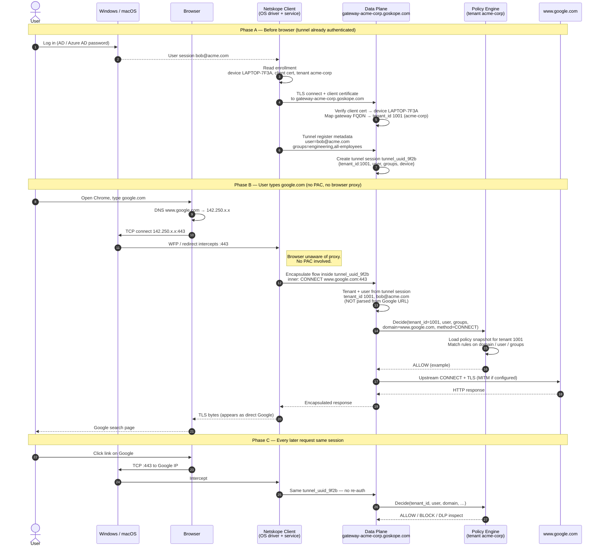

- [Overview](#ov)
- [Identity established once, not every Login](#once)
    - [Phase 0 Enrollment at time of laptop Issuance, get client certificate (bob@acme.com)](#ph0)
    - [Phase 1 — This morning: Bob logs into the laptop (08:55)](#ph1)
    - [Phase 2 — Before Chrome opens: tunnel comes up (08:56)](#ph2)
    - [Phase 3 — Bob opens Chrome and goes to google.com(Browser have no PAC) (08:57)](#ph3)
    - [Phase 4 — Bob locks laptop, Carol logs in (multi-user laptop)](#ph4)
    - [Phase 5 - Carol uses the browser today (SAML session creation) (PAC File)](#ph5)
        - [Second site same day — Carol opens `github.com` (session reused)](#second)
- [How tenant Id is retrieved?](#how)

# Authentication and Tenant Identification

## Overview

- In Forward proxy like solution, Authentication is carried by external IDP and **JWT based tenant identification is not done**.
- This is because on hot path(data path), validating JWT token every time is time costly operation.
- Rather proxy banks on **session cookie** which is generated after successful authentication to IDP.
- For subsequent HTTP requests, browser presents session cookie and it serves as token to access internet access.

### [HTTP Authentication Flow](https://code-with-amitk.github.io/Networking/OSI-Layers/Layer-7/HTTP/HTTP_Authentication.html)
- [SAML Response, SAML Assertion](https://code-with-amitk.github.io/Languages/Markup/SAML/)

## Identity established once, not every Login

### Phase 0 Enrollment at time of laptop Issuance, get client certificate (bob@acme.com)
- IT admin Creates Netskope tenant `acme.com`; syncs users from Okta/Azure AD via SCIM. `bob@acme.com`, groups `[engineering, all-employees]`
- Registers `LAPTOP-7F3A` under tenant `acme`
- nsclient installed on Laptop with config: `tenant=acme`, `gateway=gateway-acme.goskope.com`
- Client (first run), Contacts management plane; proves device is managed. **Device ID** `LAPTOP-7F3A` registered under tenant `acme`
- Client (first run), Performs **mutual TLS**, Netskope issues a **client certificate** bound to `LAPTOP-7F3A`. Cert + private key in OS cert store / client secure storage
- Client (first run) Installs Netskope **SSL inspection root CA** on the laptop
- IdP enrollment mode, If IT used “enroll via IdP”, Bob signs into Okta **once** during first browser login. Links device `LAPTOP-7F3A` ↔ user `bob@acme.com` in Netskope

“Authenticate once” does **not** mean the user never authenticates anywhere. It means authentication is split into **two layers**:

### Phase 1 — This morning: Bob logs into the laptop (08:55)
- Bob presses power, sees Windows login, enters AD password
- Windows authenticates Bob to **Active Directory** / Azure AD join | Creates **OS session**: logged-on user `ACME\bob` or UPN `bob@acme.com`
- Netskope Client Windows service starts automatically. Service runs as SYSTEM; watches for user logon events

### Phase 2 — Before Chrome opens: tunnel comes up (08:56)
> still **before** any browser traffic.

- Netskope Client picks nearest POP via DNS / GSLB → `gateway-acme.goskope.com` (Frankfurt POP)
- **TLS handshake** with **client certificate**, Server verifies: cert issued to `LAPTOP-7F3A`, tenant `acme-corp` — **device authenticated**
- Client sends **tunnel registration** inside TLS `{ tenant: "acme-corp", user: "bob@acme.com", device_id: "LAPTOP-7F3A", groups: ["engineering","all-employees"] }`
- Data plane creates **tunnel session** Internal table: `tunnel_uuid_9f2b` → `{ tenant, user, groups, device }`
- Tunnel stays up for hours. Reconnects on sleep/wake; may refresh user if different person logs into same laptop (multi-user mode)

### Phase 3 — Bob opens Chrome and goes to google.com(Browser have no PAC) (08:57)
- Bob types `google.com` in address bar. Chrome resolves `www.google.com` → `142.250.x.x`
- Chrome opens TCP `:443` to Google. **Netskope Client driver intercepts** the connection (WFP / redirect to local client)
- No login prompt. Client does **not** open a Netskope or Okta page
- Client encapsulates flow. Inner flow: `CONNECT www.google.com:443` sent **inside existing tunnel** `tunnel_uuid_9f2b`
- HTTPS to Google. Data plane may MITM with tenant CA, inspect SNI/URL, apply RTP/DLP

### Phase 4 — Bob locks laptop, Carol logs in (multi-user laptop)
- Bob locks screen. Tunnel may stay up or pause depending on config 
- Carol logs into Windows. Client detects new OS user → `carol@acme.com`
- Client re-registers tunnel. New session `tunnel_uuid_x1` with **Carol’s** user + groups
- Carol opens google.com. Policy evaluated as **Carol**, not Bob

### Phase 5 - Carol uses the browser today (SAML session creation) (PAC File)
- Carol opens Safari. Browser fetches PAC from `https://intranet.acme.com/proxy.pac`.
- PAC says HTTPS → `PROXY eproxy-acme-corp.goskope.com:8081`.
- Carol types `google.com`. Safari sends request to **Netskope proxy**, not Google directly.
- Proxy: no auth cookie for Carol’s browser → **HTTP 302** redirect to `authservice` / SAML Forward Proxy.
- [Session Cookie is recieved](https://code-with-amitk.github.io/Networking/OSI-Layers/Layer-7/HTTP/HTTP_Authentication.html)
- Browser redirected back to original `google.com` request

#### Second site same day — Carol opens `github.com` (session reused)
- PAC → proxy again
- Request includes `Cookie: nspatoken=…`
- Proxy looks up cookie → `carol@acme.com` — **no Okta redirect**
- Policy evaluated; traffic forwarded

## How tenant Id is retrieved?

### From Session Cookie
- Auth service recieve SAML assertion after auth success. Auth service (session cookie to assertion map), and store session cookie in the browser.
- Proxy stores this sessionCookie to tenantId mapping locally(after taking from auth service) with TTL.
    - **How auth knows TenantID?** From saml response and assertions.
- Every time request comes in containing session Cookie, tenantId is found in O(1) time.

### From nsclient Tunnel
