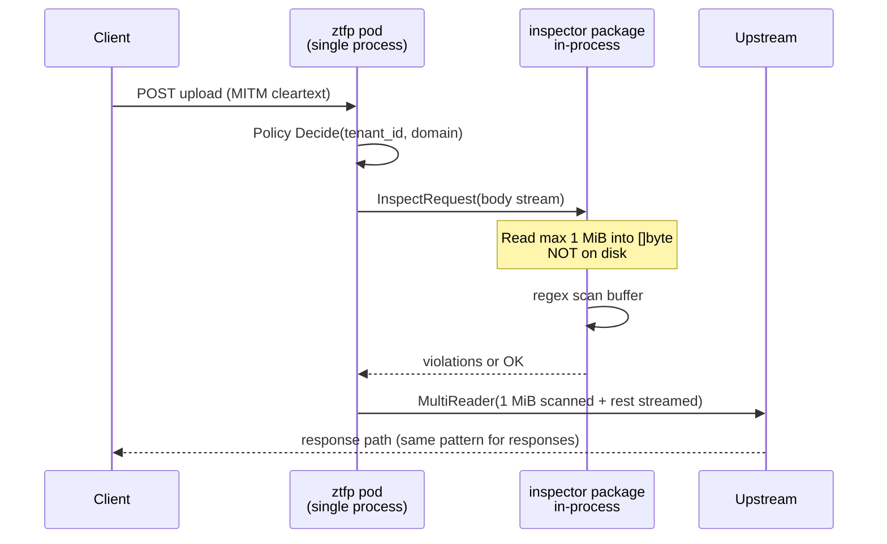
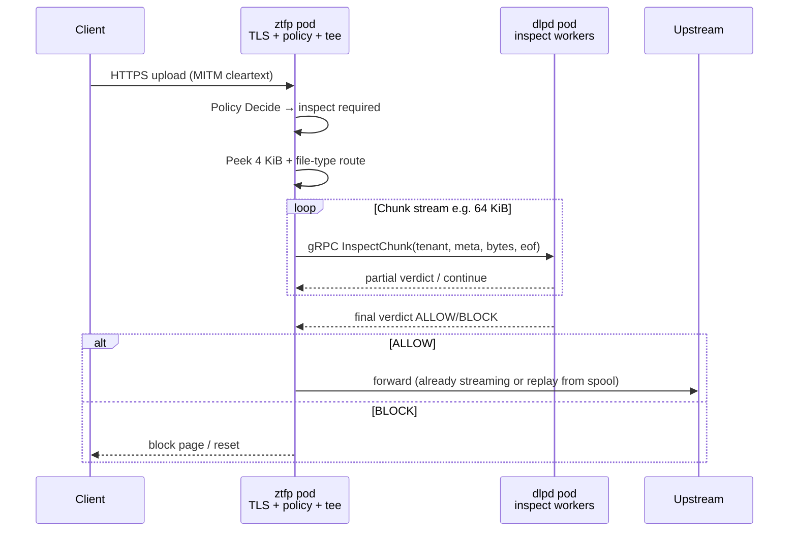
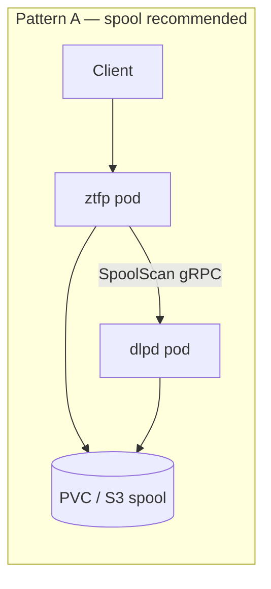

- [Phase 1 — Monolith (current)](#pd)
    - [Flow](#ph1flow)
- [Phase 2 — Separate `dlpd`, `proxy` pod in Kubernetes](#ph2)
    - [Flow](#ph2flow)
    - [Very large file (10 GiB) — async spool, not inline sync](#lf)
        - [What to scale when files grow](#scale)
    - [Phase 2 open item (must validate before moving to Phase 3)](#validate)
- [Phase 3 — On-demand DLP + presigned upload](#ph3)
    

## Phase 1 — Monolith (current)
- nsproxy does TLS Interception
- nsproxy recieve file for inspection, shares on location. DLP reads from same location
- Latency = lowest

### Flow

## Phase 2 — Separate `dlpd`, `proxy` pod in Kubernetes

- Scale DLP independently. TLS stays on **`ztfp`**; **`dlpd`** never terminates client TLS.
- When proxy and DLP run in **two Kubernetes Deployments**, context crosses the **pod network** via gRPC; **large file bytes** should use **shared spool**, not 10 GiB pod-to-pod streaming.

### Flow

### Very large file (10 GiB) — async spool, not inline sync
- **Question:** Is 10GB file recieved by 2 proxy pods(5 GiB + 5 GiB)?
    - **No** for one upload. You do **not** shard one HTTP body across two `ztfp` replicas. 
- **Question:** How much data can a **single pod** “receive”?
    - Kubernetes does **not** define a “max upload per pod.” Limits come from **memory**, **ephemeral storage / PVC size**, **CPU**, **connection duration**, and **node/network bandwidth**

**Flow** 

- ztfp accepts file, writes to **object store / spool PVC** (streaming write, not 10 GiB RAM)
- ztfp returns **hold** (block until scan), **429**, or **allow + async scan** per policy
- ztfp calls `dlpd.SpoolScan(spool_uri, metadata)`
- dlpd reads from storage in workers; may take minutes
- Verdict → callback / poll; ztfp already allowed with alert or blocked mid-upload if policy requires

#### What to scale when files grow
- `ztfp`, `dlpd` Deployment replicas
- Spool PVC size / S3 bucket + lifecycle

### Phase 2 open item (must validate before moving to Phase 3)

Before committing to zftp vs client→S3, **benchmark in your cluster**:

- Send 10GB file to zftp->spool->dlp. Check
    - MB/s reached on dlp
    - pod restarts.
    - spool deletes
    - Load test
    - **chunked gRPC** at 128 MiB vs 1 GiB — observe memory and gRPC message limits.
    - Timeout at NLB, upload duration

## Phase 3 — On-demand DLP + presigned upload

Remove **multi-gigabyte byte paths through the proxy pod**. HTTPS still terminates at **`ztfp`** (Netskope **nsproxy** equivalent). For uploads that need DLP, the proxy **orchestrates** scan via **presigned URL** and an **on-demand `dlpd`** worker — client sends bulk bytes **direct to spool storage**, not through `ztfp` RAM or pod network.

### File-type detection (first 4 KiB)

**Target:** read the first **512B – 4KiB** of body (and `Content-Type` / `Content-Disposition` headers) before choosing inspect depth.

| Detected type | Typical action |
|---------------|----------------|
| `text/json`, `text/plain` | Full regex DLP up to cap |
| `application/pdf`, `image/*`, `video/*` | Metadata-only or skip inline scan; optional async deep scan |
| `application/octet-stream` | Magic-byte table (PDF `%PDF`, ZIP `PK\x03\x04`, etc.) |
| Unknown / binary | Default shallow scan or allow-with-log per tenant policy |

**Why detect file type:** avoids wasting CPU and RAM running text regexes on compressed or binary blobs; routes large archives to async pipeline; lets policy say "block executables" without scanning entire file; reduces false positives on non-text data.

ztfp does **not** send the full file to DLP upfront. It peeks, classifies, then applies a **scan profile** (depth, patterns, async vs inline).
