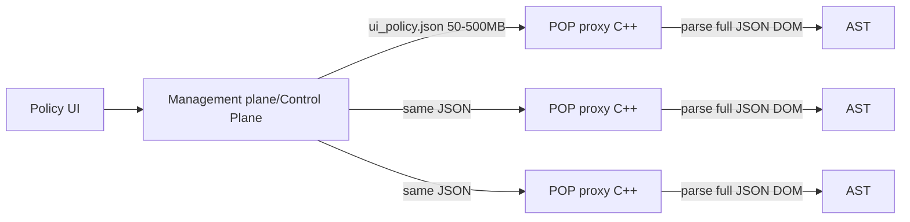
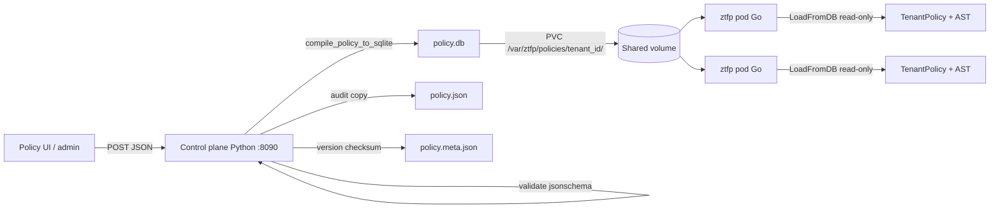

- [Overview](#overview)
- [Problem — JSON sent to DP](#problem)
- [Solution — JSON → SQLite](#solution)
- [Old flow vs new flow](#flows)
- [Control plane (Python)](#control-plane)
  - [Why JSON parsing is expensive (Python)](#python-json-cost)
- [How Python converts JSON → SQLite](#python-compile)
- [Data plane](#data-plane)
  - [Expensive full-document JSON parse (C++)](#cpp-json)
  - [Cheaper SQLite load (Go / C++)](#sqlite-load)
  - [Toy vs real schema](#toy-schema)
- [Real ztfp schema](#schema)

# Policy Distribution (json(500MB) → sqlite(400MB) → gzip(50MB))

<a name=overview></a>

## Overview

This document explains why policy packaging moved from **shipping large JSON files to every POP** (legacy data plane in **C++**) to **compiling once on the control plane** and distributing **`policy.db`** (ztfp data plane in **Go**).

| Scale reference | Notes |
|-----------------|-------|
| **scale (historical)** | `ui_policy.json` roughly **50–500 MB** per tenant; gzip artifact ~**50 MB**; SQLite ~**400 MB** uncompressed |
| **ztfp defaults today** | Control plane caps upload at **5 MB** / **5,000 rules** (`validator.py`); gzip over the wire is **planned**, not implemented in `storage.py` yet |

The proxy **never parses raw tenant policy JSON on the request hot path**. JSON is validated and compiled **once** at upload; the data plane reads **`policy.db`** and builds an in-memory AST.

---

<a name=problem></a>

## Problem — JSON sent to DP

1. Management plane produced a large **`ui_policy.json`** (50–500 MB at enterprise scale).
2. The **same JSON blob** was pushed to **every POP** (every proxy node).
3. The **data plane (C++)** parsed the **entire JSON document** on each reload — building a DOM tree, allocating strings/arrays, traversing nested `rules[]`, then building an AST.
4. Cost was paid **per POP × per reload × per pod**, with high **memory peak** and long **update latency**.


<a name=solution></a>

## Solution — JSON -> SQLite

**Redesign:** Management / control plane owns parse + validate + compile. POPs receive a **compiled artifact**.

```
ui_policy.json  →  [Control plane: validate + compile]  →  policy.db  →  gzip
                                                                          ↓
                                                                      Over Network
                                                                          ↓
                                                                Data plane: LoadFromDB → AST
```

<a name=flows></a>

## Old flow vs new flow

### Old (expensive on POP)



### New (ztfp)



<a name=control-plane></a>

## Control plane (Python)

On `POST /policy` (or `python -m policy_compiler.cli`):

1. **Receive** JSON body.
2. **Parse** → Python `dict` (`json.loads` / framework parser).
3. **Validate** — JSON Schema (`jsonschema`) + business rules (regex patterns, duplicate rule IDs, max rules/size).
4. **Normalize** — canonical document shape (`normalizer.py`).
5. **Compile** — `compile_policy_to_sqlite(doc, path)` writes `policy.db`.
6. **Persist** — atomic `policy.db.tmp` → `policy.db`; write `policy.json` (audit) and `policy.meta.json` (version, checksum).

---

<a name=python-json-cost></a>

### Why JSON parsing is expensive (Python)
- Parse Full document → nested **dict/list/str** objects in heap
- validate. Second full traversal of the tree
- Python objects are fat; **500 MB JSON** can mean **multiple GB** peak RSS

<a name=python-compile></a>

## How Python converts JSON → SQLite

From `compiler.py`:

```sql
CREATE TABLE policy_meta (
    key TEXT PRIMARY KEY,
    value TEXT NOT NULL
);

CREATE TABLE rules (
    id TEXT NOT NULL,
    policy_type TEXT NOT NULL,
    priority INTEGER NOT NULL,
    name TEXT,
    action TEXT NOT NULL,
    message TEXT,
    conditions_json TEXT NOT NULL,
    inspect_json TEXT,
    scan_fallback TEXT,
    ssl_mode TEXT,
    isolation TEXT,
    PRIMARY KEY (policy_type, id)
);

CREATE INDEX idx_rules_type_priority ON rules(policy_type, priority);
```

Compile loop (simplified):

```python
for policy_type, rule in iter_policy_rules(doc):
    conn.execute(
        "INSERT INTO rules(...) VALUES (?, ?, ..., ?, ?, ...)",
        (
            rule["id"],
            policy_type,
            rule["priority"],
            rule["action"],
            json.dumps(rule.get("conditions") or {}),
            json.dumps(rule.get("inspect") or {}) if inspect else "",
            ...
        ),
    )
```

**What compile achieves:**

- Flattens nested `policies.rtp.rules[]` into a **single ordered table**.
- Stores **`schema_version`**, **`default_action`**, **`evaluation_order`** in `policy_meta`.
- POP reads with `ORDER BY policy_type, priority, id` — same order every time.

---

<a name=data-plane></a>

## Data plane

<a name=cpp-json></a>

### Expensive full-document JSON parse (C++)
```json
{ 
  [
    { "id": 1, "url": "*.facebook.com", "action": "BLOCK" },
    { "id": 2, "url": "*.youtube.com", "action": "MONITOR" },
    { "id": 3, "url": "*.github.com", "action": "ALLOW" }
  ]
}
```
Typical DOM parsers (e.g. **RapidJSON** `Document::Parse`):

```
Read file
  → Tokenize JSON
  → Create DOM tree          ← expensive for 500 MB
  → Allocate strings/arrays
  → Traverse DOM
  → Build enforcement AST
  → Free DOM
```

For **5,000 rules** with three fields each, the DOM holds on the order of **15,000+ nodes** plus key strings — before AST indexing.

```
DOM Tree
Object
 └── rules[]
      ├── Object  → "id", "url", "action"
      ├── Object  → "id", "url", "action"
      └── Object  → "id", "url", "action"
```

At **500 MB**, peak memory during DOM build is commonly **~1.5–3× file size** (environment-dependent; not benchmarked in this repo).

---

<a name=sqlite-load></a>

### Cheaper SQLite load (Go / C++)
```
Open policy.db (read-only)
  → SELECT * FROM policy_meta
  → SELECT ... FROM rules ORDER BY policy_type, priority, id
  → For each row: scan columns; json.Unmarshal(conditions_json) if needed
  → buildAST(rules)
  → Close DB
```

|  | Json File Parsing | SQLite Parsing |
|--------|----------------------|-----------------|
| Working set | Entire document tree in RAM | One row (+ meta) at a time |
| Network to POP | Ship 50–500 MB JSON | Ship `policy.db` (gzip target) |
| Parse on POP | Re-tokenize all syntax | B-tree page reads; columns pre-extracted |

<a name=toy-schema></a>

### Toy vs real schema

The simplified teaching schema:

```sql
CREATE TABLE rules (id INTEGER, url TEXT, action INTEGER);
```

<a name=schema></a>

## Real ztfp schema (not the toy example)

On-disk layout per tenant:

```
/var/ztfp/policies/{tenant_id}/
  policy.json       # audit / rollback (control plane writes; Go does not read on hot path)
  policy.db         # compiled artifact — LoadFromDB input
  policy.meta.json  # version, checksum, compiled_at (ops; not LoadFromDB input)
```

Example row after compile:

```
policy_type | id              | priority | action | conditions_json
rtp         | rtp-block-social| 10       | BLOCK  | {"domains":["(facebook|...)\\.com$"],...}
```

Go load query (from `load_db.go`):

```go
SELECT id, policy_type, priority, name, action, message,
       conditions_json, inspect_json, scan_fallback, ssl_mode, isolation
FROM rules
ORDER BY policy_type, priority, id
```