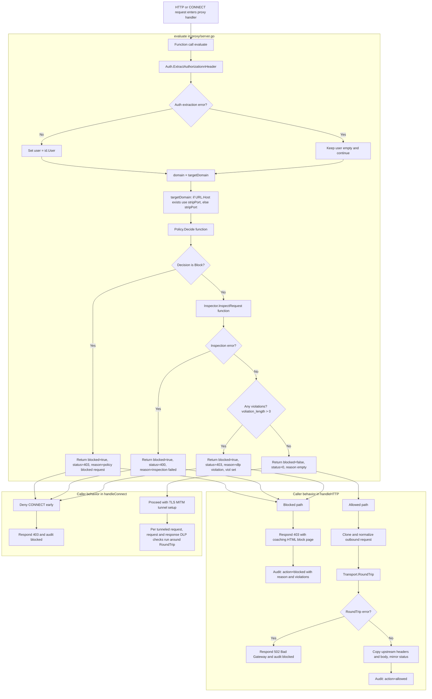

- [Policy format](#pf)
- [Flow](#flow)
- [Policy Structure](#ps)

# Policy Engine

<a name=pf></a>
## Policy format (sqlite3 db file)
* Policy is set of rules which contains domain, user, action
* ie for particular domain, user. What would be the action
* Policies are evaluated from top to bottom and checked for match

<a name=flow></a>
## Flow
- Policy processing is done in 2 paths. There are 2 seperate services controlplane(policy preprocessing), dataplane(go). Both containers talk to each other using mount shared volume policy-data → `/var/ztfp/policies`.
- policy.json is sent to control plane, which converts it to sqlite3 db and places at location for Datapath(Go) code to read. dataplance(Go) runs a seperate watcher goroutine to watch the policy update(fsnotify)

1. Service [controlplane](./ControlPlane_DataPlane/). controlplane/Dockerfile. Port: 8090. Upload JSON → compile policy.db
2. ztfp. Image(root Dockerfile), ports: 8080, 9090. Forward proxy + metrics 

```json
{
  "tenant_id": 1,
  "default_action": "ALLOW",
  "policies": {
    "rtp": {
      "rules": [
        {
          "id": "rtp-block-social",
          "name": "Block social media",
          "priority": 10,
          "conditions": {
            "domains": ["(facebook|instagram|twitter|tiktok)\\.com$"],
            "methods": ["GET", "POST"],
            "saml_groups": ["all-employees"]
          }
          "action": "BLOCK",
          "message": "Social media blocked by RTP policy"
        },
        {
          "id": "rtp-dlp-internal",
          "name": "DLP on internal uploads",
          "priority": 20,
          "conditions": {
            "domains": [".*\\.internal\\.example\\.com$"],
            "methods": ["POST", "PUT"],
            "content_direction": "upload",
            "saml_groups": ["engineering", "finance"]
          },
          "inspect": {
            "dlp": true
          },
          "action": "ALLOW",
          "scan_fallback": "fallback_block",
          "message": "Internal upload scanned for sensitive data"
        },
        {
          "id": "rtp-mcp-api",
          "name": "MCP tool inspection",
          "priority": 30,
          "conditions": 
            "domains": ["api\\.openai\\.com$"],
            "methods": ["POST"]

          }
          "inspect": {
            "mcp": {
              "tool_names": ["file_.*", "shell_.*"],
              "message_types": ["tool_call"]
            }
          },
          "action": "BLOCK",
          "scan_fallback": "fallback_alert",
          "message": "Blocked MCP tool usage"
        }
      ]
    }
  }
}
```

2. Data plane(Go code) reads the policy, creates its AST and takes policy decisions on run time when packet comes from tenant.

- Rule matching is first-match-wins.
- `user` can be exact or `*`.
- `domain` supports:
  - exact: `example.com`
  - wildcard suffix: `*.example.com`
  - global wildcard: `*`
- If no rule matches, `default_action` is used.

### Actios
**Allow**

* On action=Allow, request is forwarded to destination server
* As response is received from destination server, response is returned to client

**Block**

* Request is dropped at proxy and a coaching message is sent to client (HTTP path) or denied for CONNECT

### In-depth evaluate() decision flow
* Whenever a request arrives at proxy handlers (`handleHTTP` / `handleConnect`), both paths call:
  * `func (s *Server) evaluate(r *http.Request) (user, domain string, blocked bool, status int, reason string, viol []inspector.Violation)`



<a name=ps></a>
## Policy Structure
From above json this is how policy is stored in AST inside go module
Per tenant information storage:

```go
type TenantPolicy struct {
	TenantID        int64
	DefaultAction   Action
	EvaluationOrder []string
	Rules           []RuleRecord
	ast             *PolicyAST
	mu              sync.RWMutex
}
tp TenantPolicy

// Read all rows from db
rows, err := db.Query(`
  SELECT id, policy_type, priority, name, action, message,
          conditions_json, inspect_json, scan_fallback, ssl_mode, isolation
  FROM rules
  ORDER BY policy_type, priority, id
`)

for rows.Next() {
  if err := rows.Scan(
    &rec.ID, &rec.PolicyType, &rec.Priority, &rec.Name, &rec.Action, &rec.Message,
    &conditions, &inspectRaw, &scanFallback, &sslMode, &isolation,
  );
  tp.Rules = append(tp.Rules, rec)
}
```