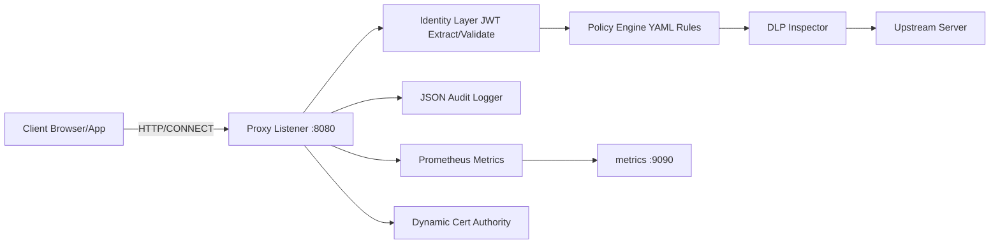

# Architecture Diagram

## Notes
- Proxy runs as `net/http` server with explicit `CONNECT` MITM handling.
- CA module auto-creates root CA and issues per-domain leaf certs (cached in memory).
- Policy and DLP are enforced before upstream forwarding for both HTTP and HTTPS-decrypted traffic.
