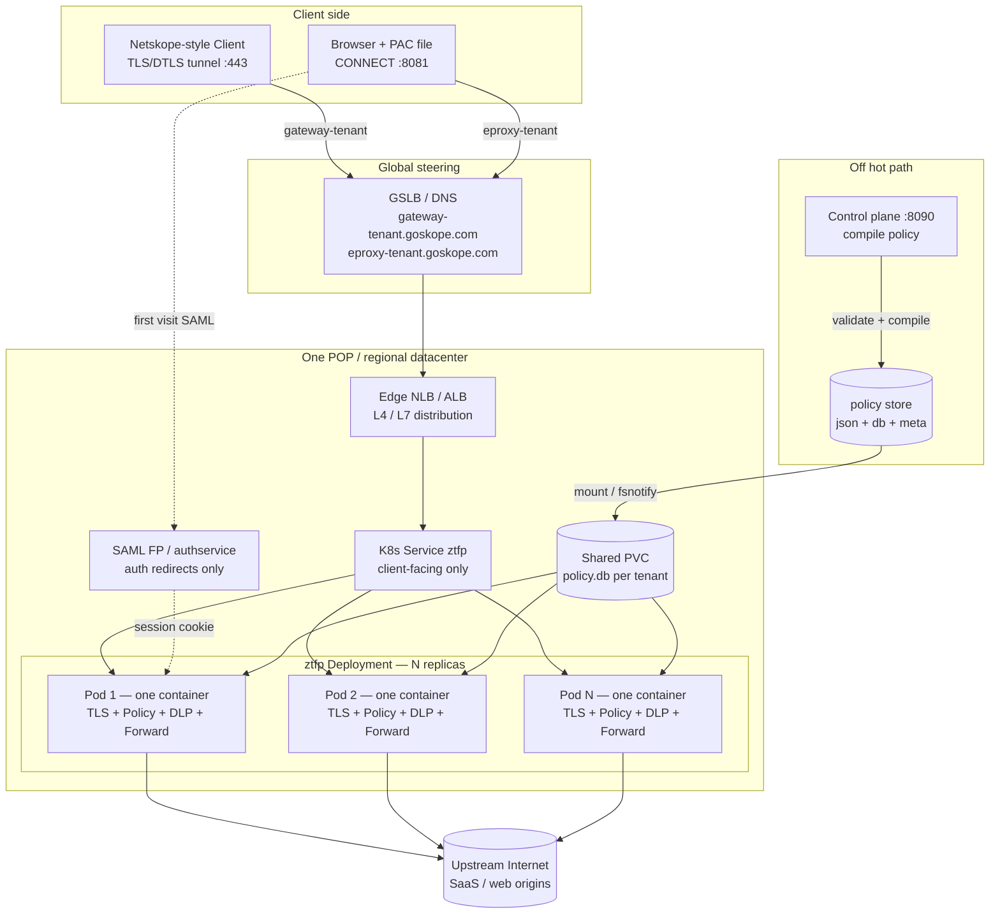
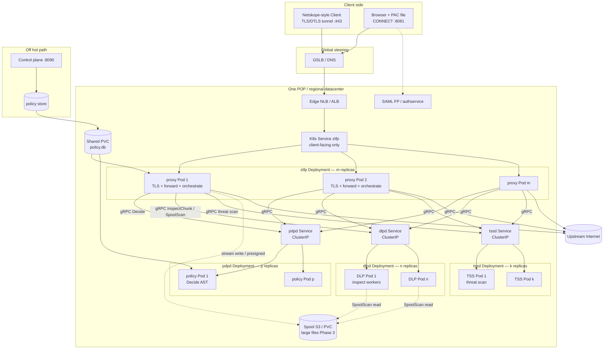
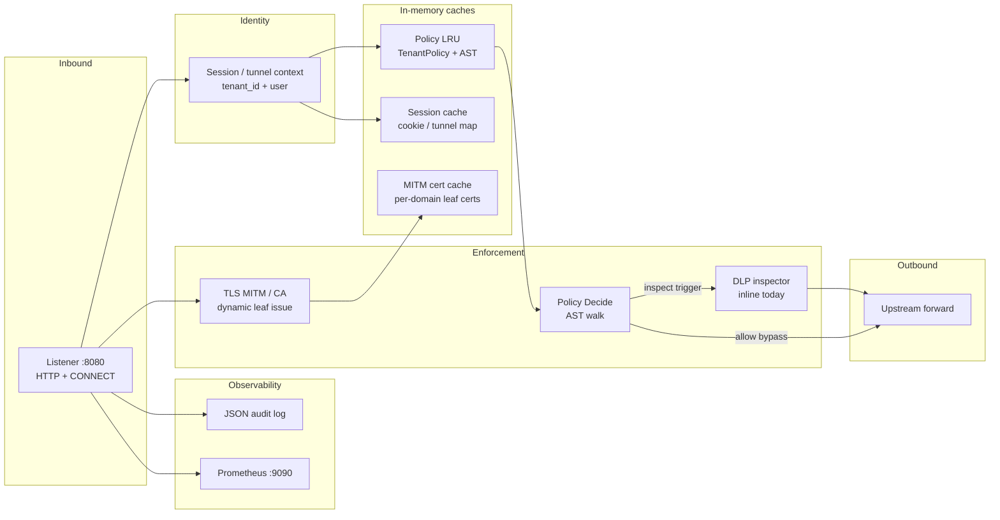
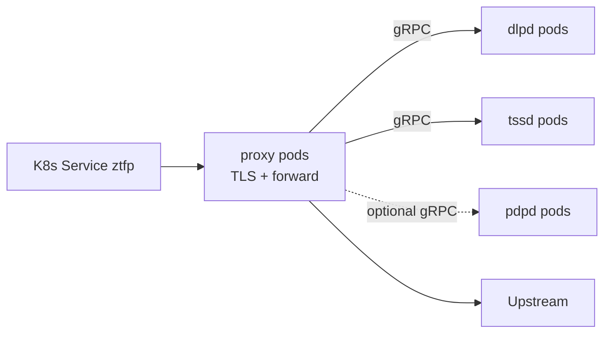

- [Overview](#overview)
- [Phase 1 — Monolith (current)](#phase-1)
- [Phase 2 — Separate pods (target)](#phase-2)
- [Deployment architecture — POP + Kubernetes](#deployment)
- [Single proxy pod — internal path](#pod-internal)
- [Caches](#caches)
- [TLS, policy, and DLP — separate microservices?](#microservices)
- [Current vs target](#current-vs-target)
- [Related documents](#related)

# Architecture

<a name="overview"></a>

## Overview
ZeroTrustForwardProxy (ztfp) follows a **Netskope-style edge model**: clients steer traffic to a regional **POP**, traffic is distributed across **many data-plane instances**, and each instance performs inline TLS (where configured), identity, policy, DLP, and forward.

## Phase-1: Initial Design (Netskope style)
- DLP, TSS and proxy all runs in 1 monolith. This saves N/W delay which incurs while sending requests between pods(over kubernets network between pods(~0.5–2 ms)).
- 
```
NLB
 ├── Monolith  [TLS + Policy + DLP]
 ├── Replica 1  [TLS + Policy + DLP]
 └── replica 2  [TLS + Policy + DLP]
```


```mermaid
flowchart TB
    subgraph ClientSide [Client side]
        NC[Netskope-style Client<br/>TLS/DTLS tunnel :443]
        BR[Browser + PAC file<br/>CONNECT :8081]
    end

    subgraph Global [Global steering]
        GSLB[GSLB / DNS<br/>gateway-tenant.goskope.com<br/>eproxy-tenant.goskope.com]
    end

    subgraph POP [One POP / regional datacenter]
        Edge[Edge NLB / ALB<br/>L4 / L7 distribution]
        K8sSvc[K8s Service ztfp<br/>client-facing only]
        Auth[SAML FP / authservice<br/>auth redirects only]

        subgraph ZtfpDeploy [ztfp Deployment — N replicas]
            P1["Pod 1 — one container<br/>TLS + Policy + DLP + Forward"]
            P2["Pod 2 — one container<br/>TLS + Policy + DLP + Forward"]
            PN["Pod N — one container<br/>TLS + Policy + DLP + Forward"]
        end

        PVC[(Shared PVC<br/>policy.db per tenant)]
    end

    subgraph OffHotPath [Off hot path]
        MP[Control plane :8090<br/>compile policy]
        CPStore[(policy store<br/>json + db + meta)]
    end

    Internet[(Upstream Internet<br/>SaaS / web origins)]

    NC -->|gateway-tenant| GSLB
    BR -->|eproxy-tenant| GSLB
    GSLB --> Edge
    Edge --> K8sSvc
    K8sSvc --> P1
    K8sSvc --> P2
    K8sSvc --> PN
    BR -.->|first visit SAML| Auth
    Auth -.->|session cookie| P1

    MP -->|validate + compile| CPStore
    CPStore -->|mount / fsnotify| PVC
    PVC --> P1
    PVC --> P2
    PVC --> PN

    P1 --> Internet
    P2 --> Internet
    PN --> Internet
```

| Scale unit | What you get |
|------------|--------------|
| `kubectl scale deployment ztfp --replicas=3` | 3 pods, each running **all** of TLS + policy + DLP |
| Pod | Smallest Kubernetes scale unit — new traffic spike → new **pod**, not new container in existing pod |

See [Single proxy pod — internal path](#pod-internal) for the in-process request pipeline.


## Phase-2: Seperate Pods
- Unlike published Netskope docs (bare-metal microservices), **ztfp target deployment uses Kubernetes**. external load balancer → edge distribution → **Kubernetes Service** → **multiple proxy pods**.
- The old single-box diagram (`Client → :8080 → Policy → DLP`) remains valid **inside one pod** — see [Single proxy pod](#pod-internal).
- POD is smallest unit to scale in kubernets.
- If traffic spikes, Kubernetes spins up a new Pod (not new container)
- m proxy pods, n DLP pods, k TSS pods. its many to many mesh.
```
NLB
 ├── kubernets LB  pod1(proxy)  pod2(proxy) pod2(proxy)

                    pod3(DLP)   pod4(DLP)

                    pod5(TSS)   pod6(TSS)

                    pod7(policy)

each service running in its own container inside its pod

                  ┌─────────────────────────────────────────┐
Client ──► GSLB ──► Edge NLB ──►   ----                     │
                  └──────────────────┬──────────────────────┘
                                     │
            ┌────────────────────────┼────────────────────────┐
            ▼                        ▼                        ▼
       proxy Pod 1              proxy Pod 2              proxy Pod 3
       (TLS + forward)          (TLS + forward)          (TLS + forward)
            │                        │                        │
            └──────────── gRPC (any pod can call any backend) ─┘
                        │              │              │
                        ▼              ▼              ▼
                 Service: pdpd    Service: dlpd   Service: tssd
                 (policy pods)    (DLP pods)      (TSS pods)
                        │              │              │
                        └──────────────┴──────────────┘
                                       │
                                  Spool S3/PVC  (large files, Phase 3)
```

**Status:** Planned — separate Deployments for proxy, DLP, TSS (and optionally policy).

Unlike bare-metal Netskope microservices, ztfp maps each function to a **Kubernetes Deployment**. The **pod** is the smallest scale unit: `m` proxy pods, `n` DLP pods, `k` TSS pods — scaled **independently**.

**Client traffic** still enters only through the **proxy Service** (GSLB → Edge NLB → K8s Service → `ztfp` pods). DLP, TSS, and policy are **internal ClusterIP Services** — not on the external LB path.

**Mesh:** Any proxy pod may call any backend pod via internal Services (many-to-many), not fixed proxy₁→DLP₁ pairing.


```mermaid
flowchart TB
    subgraph ClientSide [Client side]
        NC[Netskope-style Client<br/>TLS/DTLS tunnel :443]
        BR[Browser + PAC file<br/>CONNECT :8081]
    end

    subgraph Global [Global steering]
        GSLB[GSLB / DNS]
    end

    subgraph POP [One POP / regional datacenter]
        Edge[Edge NLB / ALB]
        K8sProxy[K8s Service ztfp<br/>client-facing only]
        Auth[SAML FP / authservice]

        subgraph ProxyDeploy [ztfp Deployment — m replicas]
            PP1["proxy Pod 1<br/>TLS + forward + orchestrate"]
            PP2["proxy Pod 2<br/>TLS + forward + orchestrate"]
            PPM["proxy Pod m"]
        end

        subgraph DLPDeploy [dlpd Deployment — n replicas]
            DP1["DLP Pod 1<br/>inspect workers"]
            DPN["DLP Pod n"]
        end

        subgraph TSSDeploy [tssd Deployment — k replicas]
            TP1["TSS Pod 1<br/>threat scan"]
            TPK["TSS Pod k"]
        end

        subgraph PolicyDeploy [pdpd Deployment — p replicas]
            PDP1["policy Pod 1<br/>Decide AST"]
            PDPP["policy Pod p"]
        end

        SvcDLP[dlpd Service<br/>ClusterIP]
        SvcTSS[tssd Service<br/>ClusterIP]
        SvcPDP[pdpd Service<br/>ClusterIP]

        Spool[(Spool S3 / PVC<br/>large files Phase 3)]
        PVC[(Shared PVC<br/>policy.db)]
    end

    subgraph OffHotPath [Off hot path]
        MP[Control plane :8090]
        CPStore[(policy store)]
    end

    Internet[(Upstream Internet)]

    NC --> GSLB
    BR --> GSLB
    GSLB --> Edge
    Edge --> K8sProxy
    K8sProxy --> PP1
    K8sProxy --> PP2
    K8sProxy --> PPM
    BR -.-> Auth

    PP1 -->|gRPC Decide| SvcPDP
    PP1 -->|gRPC InspectChunk / SpoolScan| SvcDLP
    PP1 -->|gRPC threat scan| SvcTSS
    PP2 -->|gRPC| SvcPDP
    PP2 -->|gRPC| SvcDLP
    PP2 -->|gRPC| SvcTSS
    PPM -->|gRPC| SvcPDP
    PPM -->|gRPC| SvcDLP
    PPM -->|gRPC| SvcTSS

    SvcPDP --> PDP1
    SvcPDP --> PDPP
    SvcDLP --> DP1
    SvcDLP --> DPN
    SvcTSS --> TP1
    SvcTSS --> TPK

    PP1 -.->|stream write / presigned| Spool
    DP1 -.->|SpoolScan read| Spool
    DPN -.->|SpoolScan read| Spool

    MP --> CPStore
    CPStore --> PVC
    PVC --> PP1
    PVC --> PDP1

    PP1 --> Internet
    PP2 --> Internet
    PPM --> Internet
```

| Deployment | Container role | Behind external NLB? | Scale when… |
|------------|----------------|----------------------|-------------|
| **ztfp** | TLS MITM, identity, orchestration, upstream forward | **Yes** | Connection count, TLS CPU |
| **dlpd** | DLP engine, chunk + spool scan | No — internal only | Inspect CPU, large-file queue |
| **tssd** | Threat / malware scan | No — internal only | Threat CPU |
| **pdpd** | Policy `Decide()` (optional early split) | No — internal only | Tenant count / policy RAM |

**Note:** Policy may stay **in-process on proxy pods** in an early Phase 2 rollout; split to **`pdpd`** when tenant AST memory exceeds pod budget. TSS is not in the repo yet.

---

<a name="deployment"></a>

## Deployment architecture — POP + Kubernetes

POP-level diagrams: [Phase 1 — monolith](#phase-1) (current) and [Phase 2 — separate pods](#phase-2) (target).

### Traffic paths

| Source | Entry | Through POP |
|--------|-------|-------------|
| **Client agent** | `gateway-<tenant>.goskope.com:443` TLS tunnel | GSLB → Edge NLB → K8s Service → pod |
| **Browser + PAC** | `eproxy-<tenant>.goskope.com:8081` CONNECT | Same |
| **Policy admin** | Control plane `:8090` POST | **Not** on user hot path — writes disk only |

### Load balancing layers

| Layer | Role | ztfp implementation |
|-------|------|---------------------|
| **GSLB / DNS** | Pick nearest POP / resolve tenant gateway | Customer DNS + optional GSLB API (Netskope-style) |
| **Edge L4/L7 / Anycast** | Internet-facing distribution into datacenter | Cloud **NLB/ALB** |
| **Kubernetes Service** | Spread connections across **proxy pods** | `Service` → Endpoints (Pod1…PodN) |
| **In-pod** | No second K8s hop | Monolithic process today |

Resource guards and backpressure (Phase 1D) live **inside each ztfp pod**, not at the Kubernetes Service or edge LB.

---

<a name="pod-internal"></a>

## Single proxy pod — internal path

Each pod runs the forward-proxy data plane. **Today** TLS MITM, policy, and DLP are **one Go binary** (`cmd/proxy`).


```mermaid
flowchart LR
    subgraph Inbound [Inbound]
        L[Listener :8080<br/>HTTP + CONNECT]
    end

    subgraph Identity [Identity]
        ID[Session / tunnel context<br/>tenant_id + user]
    end

    subgraph Caches [In-memory caches]
        PC[Policy LRU<br/>TenantPolicy + AST]
        CC[MITM cert cache<br/>per-domain leaf certs]
        SC[Session cache<br/>cookie / tunnel map]
    end

    subgraph Enforce [Enforcement]
        PE[Policy Decide<br/>AST walk]
        TLS[TLS MITM / CA<br/>dynamic leaf issue]
        DLP[DLP inspector<br/>inline today]
    end

    subgraph Out [Outbound]
        UP[Upstream forward]
    end

    subgraph Obs [Observability]
        AUD[JSON audit log]
        MET[Prometheus :9090]
    end

    L --> ID
    ID --> PC
    PC --> PE
    PE -->|inspect trigger| DLP
    L --> TLS
    TLS --> CC
    ID --> SC
    DLP --> UP
    PE -->|allow bypass| UP
    L --> AUD
    L --> MET
```

### Request order (HTTPS CONNECT)

```
CONNECT → identity (tenant + user)
       → policy LRU lookup → Decide()
       → if SSL decrypt: MITM cert cache → TLS to client + upstream
       → if inspect: DLP peek/scan
       → forward to upstream Internet
```

---

<a name="caches"></a>
## Caches

| Cache | Location | Scope | Purpose | Config / notes |
|-------|----------|-------|---------|----------------|
| **Policy LRU** | Each pod RAM | Per pod (not shared across pods) | `tenant_id` → `TenantPolicy` + AST; avoid SQLite on hot path | `ZTFP_POLICY_CACHE_SIZE` (default **500** tenants) |
| **Cold-load dedupe** | Each pod | Per pod | `singleflight` — one disk load per tenant per miss | `ZTFP_POLICY_LOAD_WORKERS` (default **4**) |
| **MITM cert cache** | Each pod RAM | Per pod | Issued leaf certs per domain (CONNECT MITM) | In-memory map + RWMutex; shared root CA via K8s Secret |
| **Session / identity** | Each pod RAM | Per pod | SAML cookie → user; tunnel id → user + tenant | PAC path; Client path uses tunnel metadata |
| **Policy files on disk** | Shared **PVC** | **All pods in POP** | `policy.db` compiled by control plane | `/var/ztfp/policies/{tenant_id}/`; fsnotify reload |
| **OS page cache** | Kernel | Node | Speeds repeated `policy.db` reads on cold load | Automatic |

**Important:** Policy **decision** cache (AST) is **per pod**. After LRU eviction or new pod scale-up, the first request for a tenant on that pod may cold-load from PVC (see [500_Requests_from_Cold_Tenant.md](ControlPlane_DataPlane/Dataplane/500_Requests_from_Tenant_whose_context_is_not_in_Cache.md)).

---

<a name="microservices"></a>
## TLS, policy, and DLP — separate microservices?

| Component | Separate microservice? | Recommendation |
|-----------|------------------------|----------------|
| **TLS / MITM (CONNECT)** | **No** — stays in **proxy pod** | Termination and byte forwarding are tied to the connection; splitting adds latency and FD complexity without Netskope-style benefit |
| **Policy engine (Decide)** | **In-process today**; optional **external PDP** later (A3) | LRU + AST in pod is the default; external PDP only if RAM / tenant count exceeds single-pod ceiling |
| **DLP inspect** | **Optional separate service** (Phase 2, A2) | Start **in-process** with semaphores (Phase 1D); split to **`dlpd`** when inspect CPU or OOM dominates |

### Phase 1 (current on K8s) — monolithic pod

See [Phase 1 diagram](#phase-1). One container image (`ztfp`); scale **replicas** horizontally. Phase 1D resource guards live **inside** the binary.

### Phase 2 (decomposition)

See [Phase 2 diagram](#phase-2). Proxy pods call **`dlpd`**, **`tssd`**, and optionally **`pdpd`** over internal gRPC. TLS stays in the proxy pod.


```mermaid
flowchart LR
    K8sLB[K8s Service ztfp] --> PP[proxy pods<br/>TLS + forward]
    PP -->|gRPC| DLPd[dlpd pods]
    PP -->|gRPC| TSSd[tssd pods]
    PP -.->|optional gRPC| PDP[pdpd pods]
    PP --> Internet[Upstream]
```

| Split | When |
|-------|------|
| **dlpd** separate | Sustained inspect CPU > ~30%, or inspect memory isolation needed |
| **External PDP** | Tenant policy RAM exceeds pod budget; proxy becomes forward-only |
| **TLS separate** | **Not planned** — keep in proxy |

Netskope describes **inline microservices on bare metal** at the POP; ztfp maps that to **K8s pods** first, with **optional DLP Deployment** when inspect becomes the bottleneck.

---

<a name="current-vs-target"></a>
## Current vs target

| Area | Today (repo) | Target (this diagram) |
|------|--------------|------------------------|
| Deployment | Single process / docker-compose | POP: NLB → K8s Service → N replicas |
| Policy | `TenantPolicyRegistry` LRU ✅ | Shared PVC + per-pod LRU |
| Identity | JWT dev path ✅ | Tunnel + SAML session (Netskope-style) |
| DLP | In-process ✅ | In-process + Phase 2 optional `dlpd` |
| Resource guards | Planned Phase 1D | In each pod |
| GSLB | Not implemented | Customer DNS / optional GSLB front |