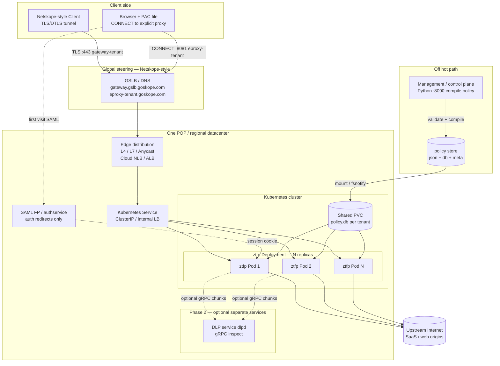
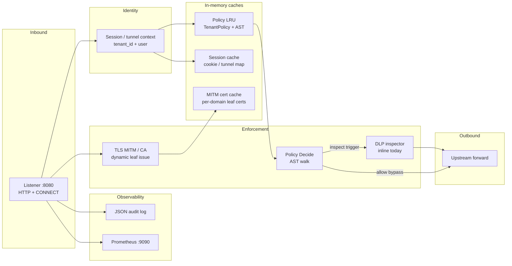
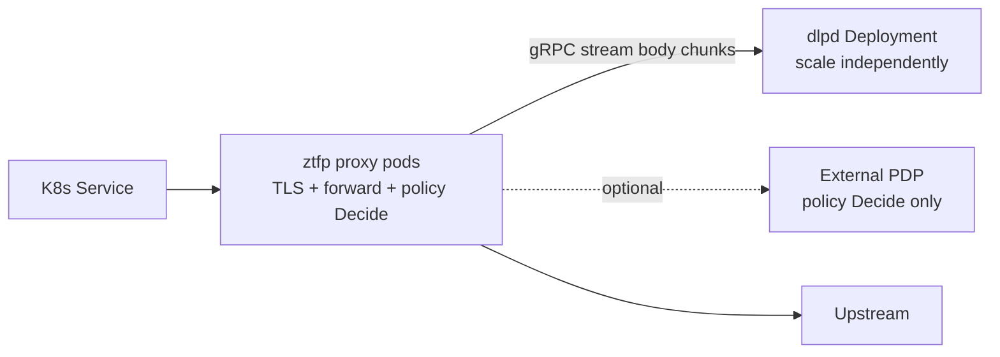

- [Overview](#overview)
- [Deployment architecture — POP + Kubernetes](#deployment)
- [Single proxy pod — internal path](#pod-internal)
- [Caches](#caches)
- [TLS, policy, and DLP — separate microservices?](#microservices)
- [Current vs target](#current-vs-target)
- [Related documents](#related)

# Architecture

<a name="overview"></a>
## Overview

ZeroTrustForwardProxy (ztfp) follows a **Netskope-style edge model**: clients steer traffic to a regional **POP**, traffic is distributed across **many data-plane instances**, and each instance performs inline TLS (where configured), identity, policy, DLP, and forward.

Unlike published Netskope docs (bare-metal microservices), **ztfp target deployment uses Kubernetes** inside each POP: external load balancer → edge distribution → **Kubernetes Service** → **multiple proxy pods**.

The old single-box diagram (`Client → :8080 → Policy → DLP`) remains valid **inside one pod** — see [Single proxy pod](#pod-internal).

---

<a name="deployment"></a>
## Deployment architecture — POP + Kubernetes


```mermaid
flowchart TB
    subgraph ClientSide [Client side]
        NC[Netskope-style Client<br/>TLS/DTLS tunnel]
        BR[Browser + PAC file<br/>CONNECT to explicit proxy]
    end

    subgraph Global [Global steering — Netskope-style]
        GSLB[GSLB / DNS<br/>gateway.gslb.goskope.com<br/>eproxy-tenant.goskope.com]
    end

    subgraph POP [One POP / regional datacenter]
        Edge[Edge distribution<br/>L4 / L7 / Anycast<br/>Cloud NLB / ALB]
        K8sLB[Kubernetes Service<br/>ClusterIP / internal LB]
        Auth[SAML FP / authservice<br/>auth redirects only]

        subgraph K8sCluster [Kubernetes cluster]
            subgraph Pods [ztfp Deployment — N replicas]
                P1[ztfp Pod 1]
                P2[ztfp Pod 2]
                P3[ztfp Pod N]
            end
            PVC[(Shared PVC<br/>policy.db per tenant)]
        end

        subgraph OptionalPhase2 [Phase 2 — optional separate services]
            DLPsvc[DLP service dlpd<br/>gRPC inspect]
        end
    end

    subgraph OffHotPath [Off hot path]
        MP[Management / control plane<br/>Python :8090 compile policy]
        CPStore[(policy store<br/>json + db + meta)]
    end

    Internet[(Upstream Internet<br/>SaaS / web origins)]

    NC -->|TLS :443 gateway-tenant| GSLB
    BR -->|CONNECT :8081 eproxy-tenant| GSLB
    GSLB --> Edge
    Edge --> K8sLB
    K8sLB --> P1
    K8sLB --> P2
    K8sLB --> P3
    BR -.->|first visit SAML| Auth
    Auth -.->|session cookie| P1

    MP -->|validate + compile| CPStore
    CPStore -->|mount / fsnotify| PVC
    PVC --> P1
    PVC --> P2
    PVC --> P3

    P1 -.->|optional gRPC chunks| DLPsvc
    P2 -.->|optional gRPC chunks| DLPsvc

    P1 --> Internet
    P2 --> Internet
    P3 --> Internet
```

### Traffic paths

| Source | Entry | Through POP |
|--------|-------|-------------|
| **Client agent** | `gateway-<tenant>.goskope.com:443` TLS tunnel | GSLB → Edge NLB → K8s Service → pod |
| **Browser + PAC** | `eproxy-<tenant>.goskope.com:8081` CONNECT | Same |
| **Policy admin** | Control plane `:8090` POST | **Not** on user hot path — writes disk only |

### Load balancing layers

| Layer | Role | ztfp implementation |
|-------|------|---------------------|
| **GSLB / DNS** | Pick nearest POP / resolve tenant gateway | Customer DNS + optional GSLB API (Netskope-style) |
| **Edge L4/L7 / Anycast** | Internet-facing distribution into datacenter | Cloud **NLB/ALB** |
| **Kubernetes Service** | Spread connections across **proxy pods** | `Service` → Endpoints (Pod1…PodN) |
| **In-pod** | No second K8s hop | Monolithic process today |

Resource guards and backpressure (Phase 1D) live **inside each ztfp pod**, not at the Kubernetes Service or edge LB.

---

<a name="pod-internal"></a>
## Single proxy pod — internal path

Each pod runs the forward-proxy data plane. **Today** TLS MITM, policy, and DLP are **one Go binary** (`cmd/proxy`).


```mermaid
flowchart LR
    subgraph Inbound [Inbound]
        L[Listener :8080<br/>HTTP + CONNECT]
    end

    subgraph Identity [Identity]
        ID[Session / tunnel context<br/>tenant_id + user]
    end

    subgraph Caches [In-memory caches]
        PC[Policy LRU<br/>TenantPolicy + AST]
        CC[MITM cert cache<br/>per-domain leaf certs]
        SC[Session cache<br/>cookie / tunnel map]
    end

    subgraph Enforce [Enforcement]
        PE[Policy Decide<br/>AST walk]
        TLS[TLS MITM / CA<br/>dynamic leaf issue]
        DLP[DLP inspector<br/>inline today]
    end

    subgraph Out [Outbound]
        UP[Upstream forward]
    end

    subgraph Obs [Observability]
        AUD[JSON audit log]
        MET[Prometheus :9090]
    end

    L --> ID
    ID --> PC
    PC --> PE
    PE -->|inspect trigger| DLP
    L --> TLS
    TLS --> CC
    ID --> SC
    DLP --> UP
    PE -->|allow bypass| UP
    L --> AUD
    L --> MET
```

### Request order (HTTPS CONNECT)

```
CONNECT → identity (tenant + user)
       → policy LRU lookup → Decide()
       → if SSL decrypt: MITM cert cache → TLS to client + upstream
       → if inspect: DLP peek/scan
       → forward to upstream Internet
```

---

<a name="caches"></a>
## Caches

| Cache | Location | Scope | Purpose | Config / notes |
|-------|----------|-------|---------|----------------|
| **Policy LRU** | Each pod RAM | Per pod (not shared across pods) | `tenant_id` → `TenantPolicy` + AST; avoid SQLite on hot path | `ZTFP_POLICY_CACHE_SIZE` (default **500** tenants) |
| **Cold-load dedupe** | Each pod | Per pod | `singleflight` — one disk load per tenant per miss | `ZTFP_POLICY_LOAD_WORKERS` (default **4**) |
| **MITM cert cache** | Each pod RAM | Per pod | Issued leaf certs per domain (CONNECT MITM) | In-memory map + RWMutex; shared root CA via K8s Secret |
| **Session / identity** | Each pod RAM | Per pod | SAML cookie → user; tunnel id → user + tenant | PAC path; Client path uses tunnel metadata |
| **Policy files on disk** | Shared **PVC** | **All pods in POP** | `policy.db` compiled by control plane | `/var/ztfp/policies/{tenant_id}/`; fsnotify reload |
| **OS page cache** | Kernel | Node | Speeds repeated `policy.db` reads on cold load | Automatic |

**Important:** Policy **decision** cache (AST) is **per pod**. After LRU eviction or new pod scale-up, the first request for a tenant on that pod may cold-load from PVC (see [500_Requests_from_Cold_Tenant.md](ControlPlane_DataPlane/Dataplane/500_Requests_from_Tenant_whose_context_is_not_in_Cache.md)).

---

<a name="microservices"></a>
## TLS, policy, and DLP — separate microservices?

| Component | Separate microservice? | Recommendation |
|-----------|------------------------|----------------|
| **TLS / MITM (CONNECT)** | **No** — stays in **proxy pod** | Termination and byte forwarding are tied to the connection; splitting adds latency and FD complexity without Netskope-style benefit |
| **Policy engine (Decide)** | **In-process today**; optional **external PDP** later (A3) | LRU + AST in pod is the default; external PDP only if RAM / tenant count exceeds single-pod ceiling |
| **DLP inspect** | **Optional separate service** (Phase 2, A2) | Start **in-process** with semaphores (Phase 1D); split to **`dlpd`** when inspect CPU or OOM dominates |

### Phase 1 (current target on K8s) — monolithic pod

```
K8s Service → [ TLS + Policy + DLP + Forward ] × N pods
```

- One container image (`ztfp`)
- Scale **replicas** horizontally
- Phase 1D resource guards **inside** the binary

### Phase 2 (optional decomposition)


```mermaid
flowchart LR
    K8sLB[K8s Service] --> PP[ztfp proxy pods<br/>TLS + forward + policy Decide]
    PP -->|gRPC stream body chunks| DLPd[dlpd Deployment<br/>scale independently]
    PP -.->|optional| PDP[External PDP<br/>policy Decide only]
    PP --> Internet[Upstream]
```

| Split | When |
|-------|------|
| **dlpd** separate | Sustained inspect CPU > ~30%, or inspect memory isolation needed |
| **External PDP** | Tenant policy RAM exceeds pod budget; proxy becomes forward-only |
| **TLS separate** | **Not planned** — keep in proxy |

Netskope describes **inline microservices on bare metal** at the POP; ztfp maps that to **K8s pods** first, with **optional DLP Deployment** when inspect becomes the bottleneck.

---

<a name="current-vs-target"></a>
## Current vs target

| Area | Today (repo) | Target (this diagram) |
|------|--------------|------------------------|
| Deployment | Single process / docker-compose | POP: NLB → K8s Service → N replicas |
| Policy | `TenantPolicyRegistry` LRU ✅ | Shared PVC + per-pod LRU |
| Identity | JWT dev path ✅ | Tunnel + SAML session (Netskope-style) |
| DLP | In-process ✅ | In-process + Phase 2 optional `dlpd` |
| Resource guards | Planned Phase 1D | In each pod |
| GSLB | Not implemented | Customer DNS / optional GSLB front |

---

<a name="related"></a>
## Related documents

| Document | Topic |
|----------|--------|
| [Authentication.md](Authentication.md) | Client vs PAC identity |
| [ControlPlane_DataPlane/What.md](ControlPlane_DataPlane/What.md) | Control vs data plane |
| [docs/creating_pods.md](../docs/creating_pods.md) | K8s NLB + replicas |
| [docs/horizontal_scaling.md](../docs/horizontal_scaling.md) | Monolithic vs decomposed |
| [docs/policy_changes.md](../docs/policy_changes.md) | Phase 1D guards, LRU, A2/A3 |
| [ControlPlane_DataPlane/Dataplane/DLP_Inspection_Architecture.md](ControlPlane_DataPlane/Dataplane/DLP_Inspection_Architecture.md) | DLP peek tiers |
