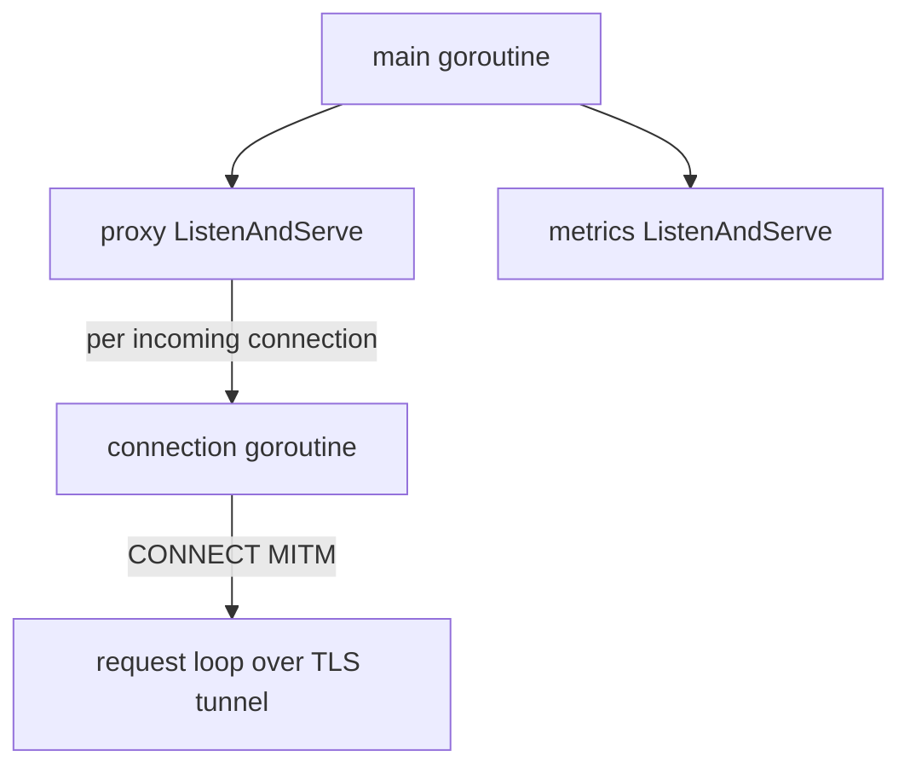

# Concurrency and Goroutine Model

## Goroutines Used

- 1 goroutine for main control path.
- 1 dedicated goroutine for metrics endpoint server.
- `net/http` spawns goroutines per connection/request automatically.
- CONNECT MITM handling stays non-blocking across clients because each tunnel runs independently.

## Why This Works
- Goroutine-per-connection is suitable for high concurrency in Go.
- Shared resources are concurrency-safe:
  - CA cert cache guarded by RWMutex
  - HTTP transport uses internal pooling and safe reuse
- No global blocking calls in hot path besides network I/O.
