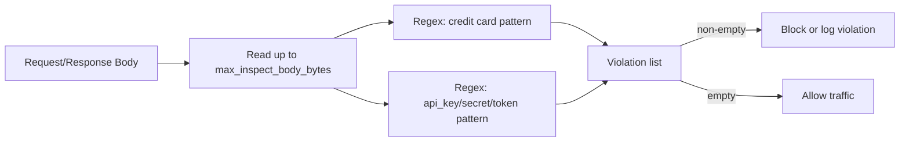

# DLP Engine Design

## Detection Approach
- No external DLP library is used in this implementation.
- Detection is regex-based:
  - Credit-card-like number pattern (`13-16` digits with optional spaces/hyphens)
  - Secret pattern (`api_key`, `secret`, `token` followed by value)
- Body is restored after inspection so forwarding still works.

## Extensibility
- You can plug in external engines (e.g. Hyperscan, custom ML, SaaS DLP APIs) by replacing `inspector.Inspector`.
