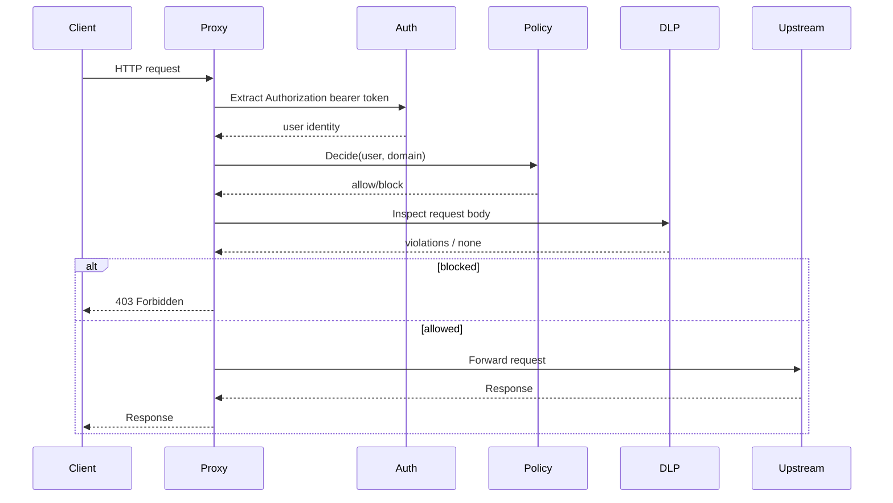
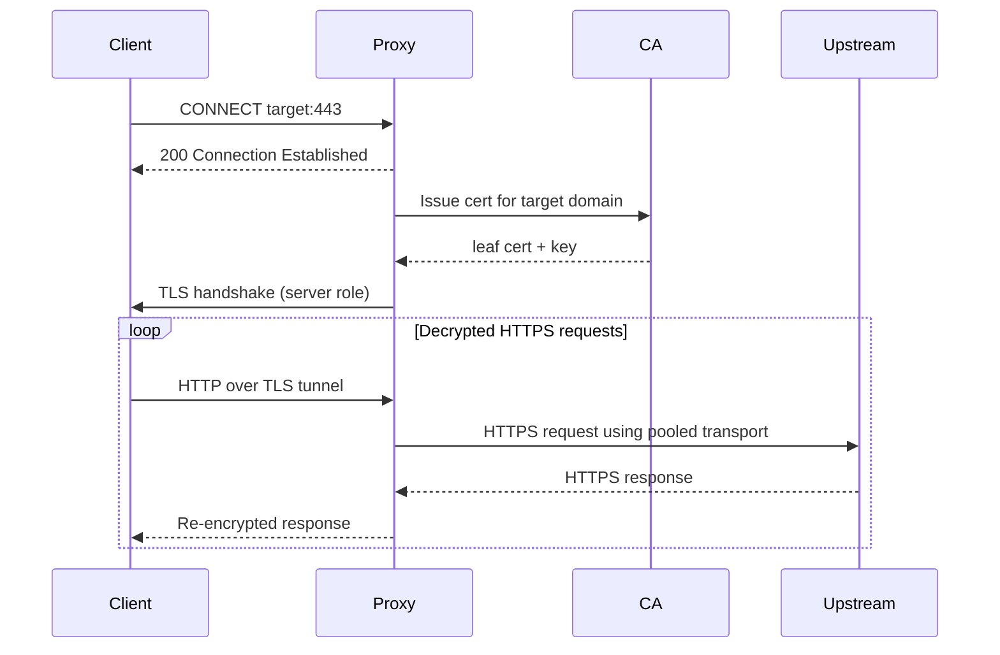
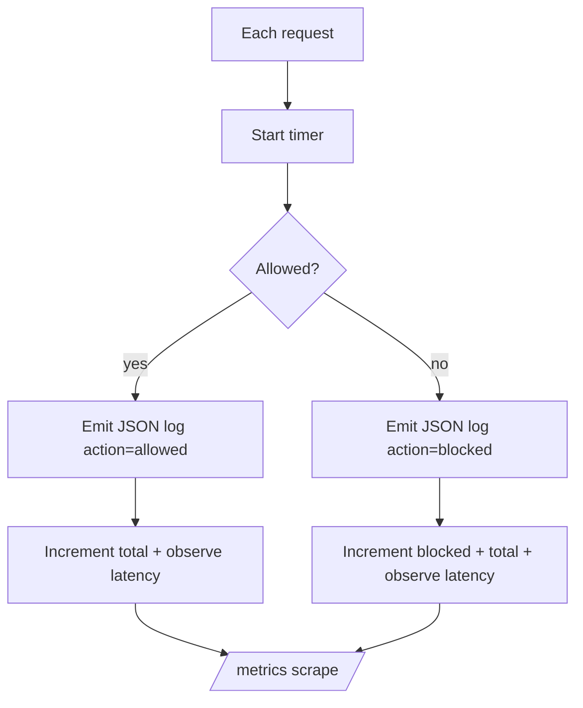

# Feature Flow Diagrams

## HTTP Request Flow

```mermaid
sequenceDiagram
    participant Client
    participant Proxy
    participant Auth
    participant Policy
    participant DLP
    participant Upstream

    Client->>Proxy: HTTP request
    Proxy->>Auth: Extract Authorization bearer token
    Auth-->>Proxy: user identity
    Proxy->>Policy: Decide(user, domain)
    Policy-->>Proxy: allow/block
    Proxy->>DLP: Inspect request body
    DLP-->>Proxy: violations / none
    alt blocked
        Proxy-->>Client: 403 Forbidden
    else allowed
        Proxy->>Upstream: Forward request
        Upstream-->>Proxy: Response
        Proxy-->>Client: Response
    end
```

## HTTPS CONNECT MITM Flow

```mermaid
sequenceDiagram
    participant Client
    participant Proxy
    participant CA
    participant Upstream

    Client->>Proxy: CONNECT target:443
    Proxy-->>Client: 200 Connection Established
    Proxy->>CA: Issue cert for target domain
    CA-->>Proxy: leaf cert + key
    Proxy->>Client: TLS handshake (server role)
    loop Decrypted HTTPS requests
      Client->>Proxy: HTTP over TLS tunnel
      Proxy->>Upstream: HTTPS request using pooled transport
      Upstream-->>Proxy: HTTPS response
      Proxy-->>Client: Re-encrypted response
    end
```

## Metrics and Logging Flow

```mermaid
flowchart TD
    R[Each request] --> S[Start timer]
    S --> D{Allowed?}
    D -- yes --> AL[Emit JSON log action=allowed]
    D -- no --> BL[Emit JSON log action=blocked]
    AL --> MT[Increment total + observe latency]
    BL --> MB[Increment blocked + total + observe latency]
    MT --> E[/metrics scrape/]
    MB --> E
```
