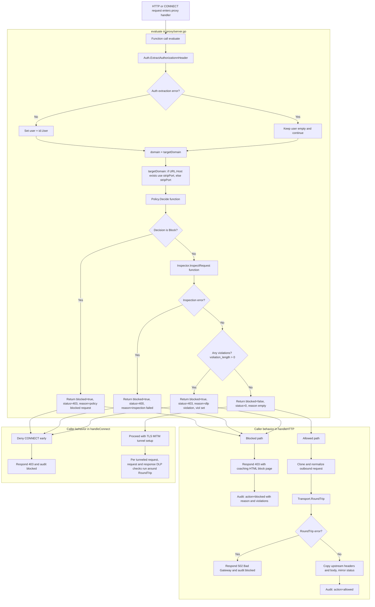

# Policy Engine
## Policy format (policy.yaml)
* Policy is set of rules which contains domain, user, action
* ie for particular domain, user. What would be the action
* Policies are evaluated from top to bottom and checked for match

## Flow
* policy.yaml is read into internal DS
```
rules:
  - user: "alice"
    domain: "www.google.com"
    action: allow
```

* Whenever a request arrives at proxy handlers (`handleHTTP` / `handleConnect`), both paths call:
  * `func (s *Server) evaluate(r *http.Request) (user, domain string, blocked bool, status int, reason string, viol []inspector.Violation)`

### In-depth evaluate() decision flow


### Action=Allow
* On action=Allow, request is forwarded to destination server
* As response is received from destination server, response is returned to client

### Action=Block
* Request is dropped at proxy and a coaching message is sent to client (HTTP path) or denied for CONNECT

## Evaluation Logic
- Rule matching is first-match-wins.
- `user` can be exact or `*`.
- `domain` supports:
  - exact: `example.com`
  - wildcard suffix: `*.example.com`
  - global wildcard: `*`
- If no rule matches, `default_action` is used.
